A pipeline is not one thing : it's the ordered chain of stages that carries data from raw source to a served prediction, and back again through monitoring into retraining. 
 It comprises of : [[Data]]/[[ML Models]]/[[Model Stacking]]/[[Model Drift]]

==**Hence a Pipeline has: 1 Pipeline Type, N Stages (drawn from a reusable Stage Library, mapped to Data/Math/Model/Drift/Stacking codes), 1 flowchart, and only then does it inherit a final combined signature.**==

---

## Domain: Pipeline Types : The Big Picture [PL-T]

|Code|Pipeline Type|Definition|Metaphor|
|---|---|---|---|
|PL-T1|Batch ETL Pipeline|Extract → Transform → Load on a schedule; data is cleaned and shaped _before_ it lands in the warehouse|A factory assembly line : raw material is machined into its final shape before it ever reaches the shelf|
|PL-T2|Streaming ELT Pipeline|Extract → Load → Transform continuously; raw data lands first, gets transformed in-place afterward|A warehouse that accepts deliveries all day and only sorts the shelves later, as time allows|
|PL-T3|Feature Engineering & Feature Store Pipeline|Turns validated data into model-ready features, versions them, and serves them to both training and inference|A pantry that preps ingredients once and serves the same prepped batch to every recipe that needs them|
|PL-T4|Model Training Pipeline|Splits data, fits a model, tunes it, evaluates it, and registers the resulting artifact|A student studying from notes (train), practicing on mock exams (validation), then sitting the real exam (test)|
|PL-T5|Model Evaluation & Validation Pipeline|Gate-checks a trained candidate against held-out data, fairness checks, and the current production model before promotion|A board exam : passing training doesn't license you to practice, a separate certifying body still has to sign off|
|PL-T6|CI/CD Deployment Pipeline (MLOps)|Builds, tests, and ships an approved model artifact into batch or real-time serving|A software release pipeline, except the "code" being shipped is a trained model artifact instead of a binary|
|PL-T7|Batch Inference Pipeline|Scores a large dataset on a schedule and writes predictions back to storage|A mail-sorting facility : a scheduled truck arrives, an entire day's mail gets sorted at once|
|PL-T8|Real-Time / Online Inference Pipeline|Serves single predictions synchronously in response to live requests|A single teller window : one customer, one transaction, answered on the spot|
|PL-T9|Monitoring & Drift Pipeline|Continuously watches served predictions and incoming features for drift, firing alerts or retraining triggers|The building's smoke detectors, wired straight to the fire panel|
|PL-T10|Retraining / Continuous Learning Pipeline|Re-runs the full data→train→evaluate→deploy chain, either on a schedule or triggered by [DR-R2]|The scheduled fire drill that becomes a real evacuation the moment an actual alarm fires|
|PL-T11|Data Labeling / Annotation Pipeline|Routes unlabeled data through human (or human-in-the-loop) review to produce a labeled dataset|A courtroom stenographer : someone has to formally write down what happened before it counts as record|
|PL-T12|RAG (Retrieval-Augmented Generation) Pipeline|Indexes a document corpus, retrieves relevant chunks at query time, and injects them into an LLM's context before generation|A student allowed to bring an open textbook into the exam, instead of relying purely on memorized knowledge|
|PL-T13|LLM Fine-Tuning Pipeline|Prepares instruction data, runs supervised fine-tuning, then optionally aligns further via preference optimization|Sending a generalist graduate through a specialist residency before letting them practice independently|
|PL-T14|A/B Testing / Experimentation Pipeline|Splits live traffic between a champion and challenger model and statistically decides which one wins|A blind taste test : two recipes served side by side, votes tallied, only the winner stays on the menu|

---

## Domain: Reusable Stage Library [PL-S]

Every flowchart below is built entirely from these stage codes, so the same stage (e.g. "Feature Store Read") means the same thing wherever it appears across pipelines : nothing is redefined per-pipeline.

|Code|Stage|Definition|Inherits From|
|---|---|---|---|
|PL-S1|Ingestion|Pulls raw data from a source system into the pipeline's reach|A22 (sequential), A2x generally|
|PL-S2|Validation|Schema/quality/type checks on incoming or transformed data|A61-A64 (Missingness/Quality), pairs with [DR-X2]|
|PL-S3|Extract (E)|Pulls raw data from source without transforming it|—|
|PL-S4|Transform|Cleans, joins, aggregates, or reshapes data|A3x (Modality) determines transform logic|
|PL-S5|Load (L)|Writes data into a warehouse, lake, or downstream store|—|
|PL-S6|Feature Engineering|Derives model-ready features from validated data|A3x/A4x, routed like [DR-D]|
|PL-S7|Feature Store Read/Write|Versioned storage of engineered features, served to training and inference alike|A54 (Non-stationary) if features drift, requires [DR-W] windowing|
|PL-S8|Train / Val / Test Split|Partitions data before any model sees it, to prevent leakage|A21 (i.i.d.) or [ST-CV5]-style chronological split for A22 data|
|PL-S9|Model Training|Fits one or more Model Codes to the training split|Any code from ML-Model-Taxonomy [LM/TR/EN/SV/PR/IB/CL/DR/NN/NLP/GR/RLM/SA-M/TSM], or a Stacking variant [ST-V]|
|PL-S10|Hyperparameter Tuning|Searches over hyperparameter space to improve validation performance|AO1-AO5 (Advanced Optimization), CA3 (Gradient Descent) if learned|
|PL-S11|Evaluation|Computes performance metrics on held-out data|PS5/CA8/CA9/CA22 depending on task; drift-style metrics reuse [DR-M8]|
|PL-S12|Validation Gate|Pass/fail decision comparing candidate metrics against a threshold|Pairs with [DR-TH]-style severity bands|
|PL-S13|Model Registry|Versioned storage of an approved model artifact|—|
|PL-S14|CI/CD Build & Test|Packages the model artifact, runs automated integration tests|—|
|PL-S15|Batch Deployment|Schedules the model as a recurring scoring job|Pairs with [DR-W4] (Fixed-Interval Batch Monitoring)|
|PL-S16|Real-Time Deployment|Exposes the model behind a synchronous serving endpoint|Pairs with [DR-W2]/[DR-W3] (continuous monitoring)|
|PL-S17|Shadow / Champion-Challenger Deployment|Runs a new model in parallel with production before full cutover|[DR-R5] directly|
|PL-S18|Monitoring|Watches live predictions/features for drift or degradation|[DR-M]/[DR-C]/[DR-MV]/[DR-CV] (any Drift Taxonomy checker)|
|PL-S19|Alerting|Notifies a human or system once monitoring crosses a threshold|[DR-R1]|
|PL-S20|Retraining Trigger|Automatically or manually kicks off [PL-T10]|[DR-R2]|
|PL-S21|Human-in-the-Loop Review|Routes ambiguous or low-confidence cases to a human|A13 (Partially/weakly labeled) transition point|
|PL-S22|Labeling / Annotation|Produces ground-truth labels for previously unlabeled data|Moves data from A12 → A11|
|PL-S23|Retrieval Index Build|Embeds and indexes a document corpus for similarity search|LA8 (Cosine Similarity) under the hood|
|PL-S24|Retrieval Query|Finds the nearest documents/chunks to a live query embedding|LA8/LA9 (Cosine/Euclidean Distance)|
|PL-S25|Context Injection|Assembles retrieved chunks into the LLM's prompt context|—|
|PL-S26|LLM Generation|Produces the model's output conditioned on the augmented prompt|AT1-AT5 (Attention & Transformers), inherits NLP3 [GPT]-style Model Code|
|PL-S27|Fine-Tuning Data Prep|Formats instruction/response pairs for supervised fine-tuning|A11 (Labeled), A34 (Text)|
|PL-S28|Supervised Fine-Tuning (SFT) Loop|Continues training a pretrained LLM on the instruction dataset|CA3/CA4 (Gradient Descent/Chain Rule), CA9 (Cross-Entropy)|
|PL-S29|Preference Optimization (RLHF/DPO)|Further aligns the fine-tuned model using human/AI preference signal|RL1-RL4 (Reinforcement Learning Math), GM1/GM2 (Game Theory) for RLHF's actor-critic framing|
|PL-S30|Traffic Split|Divides live user traffic between champion and challenger|—|
|PL-S31|Statistical Analysis|Tests whether the challenger's metric lift is statistically real|PS9 (Conditional Probability), PS15 (p-value/Hypothesis Testing)|

---

## Domain: PL-T1 Batch ETL Pipeline

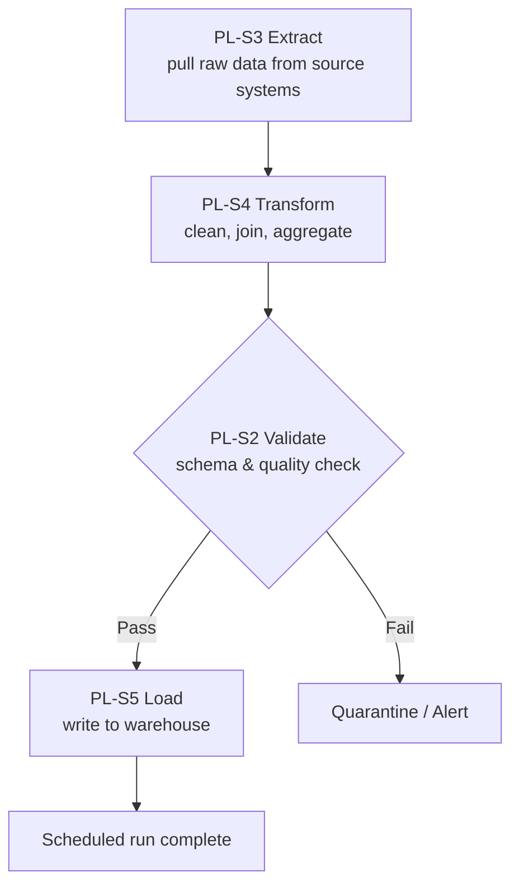

---

## Domain: PL-T2 Streaming ELT Pipeline

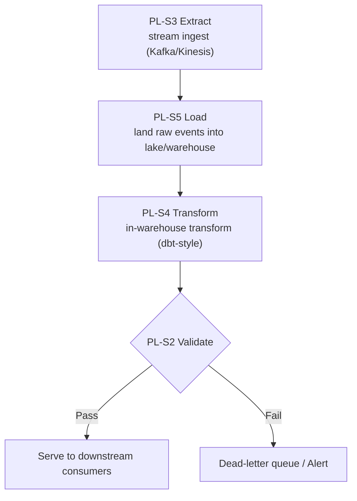

---

## Domain: PL-T3 Feature Engineering & Feature Store Pipeline

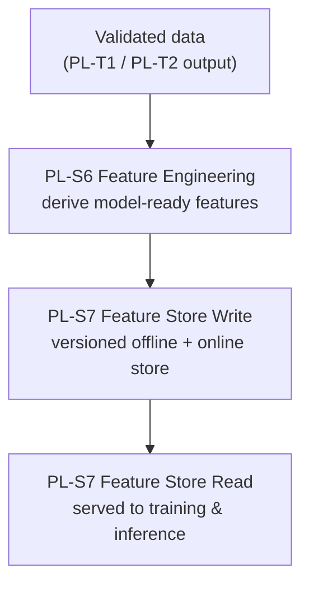

---

## Domain: PL-T4 Model Training Pipeline

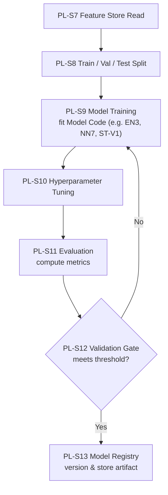

---

## Domain: PL-T5 Model Evaluation & Validation Pipeline

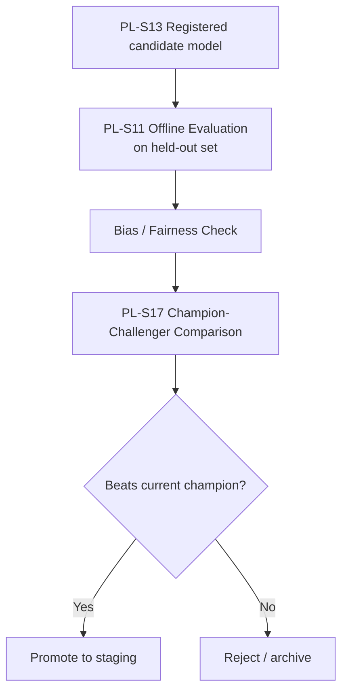

---

## Domain: PL-T6 CI/CD Deployment Pipeline (MLOps)

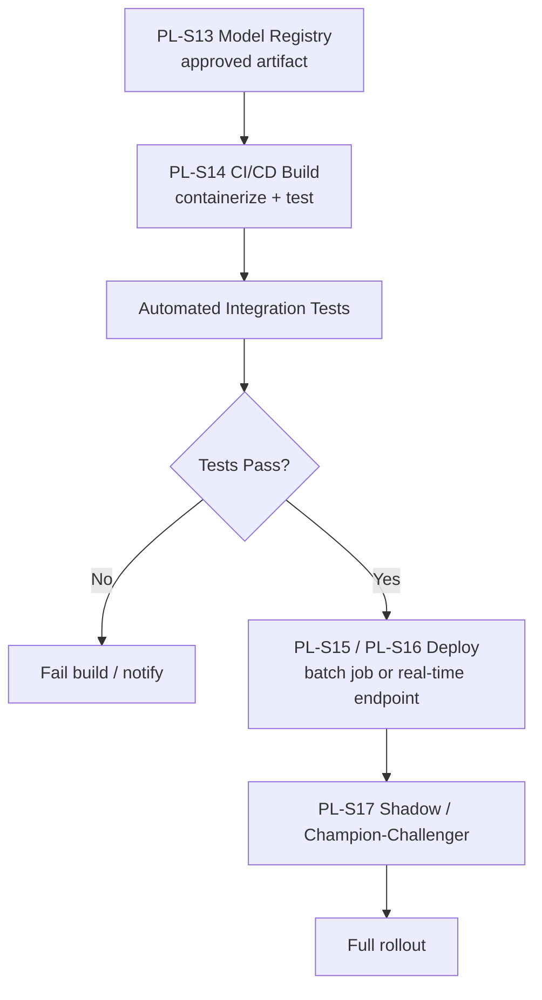

---

## Domain: PL-T7 Batch Inference Pipeline

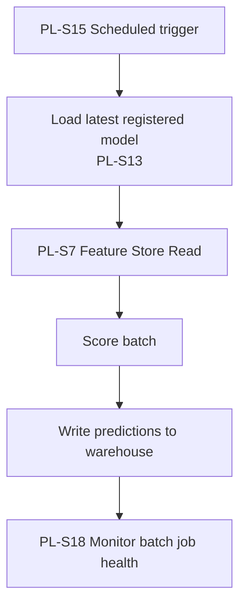

---

## Domain: PL-T8 Real-Time / Online Inference Pipeline

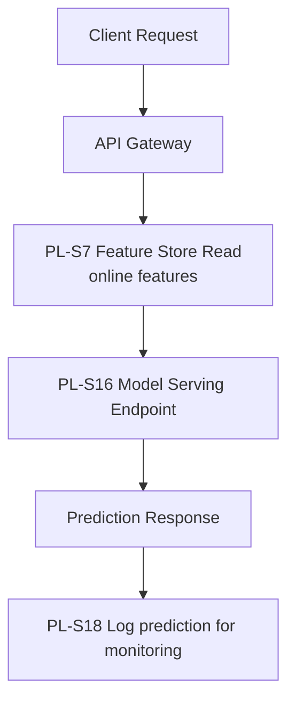

---

## Domain: PL-T9 Monitoring & Drift Pipeline

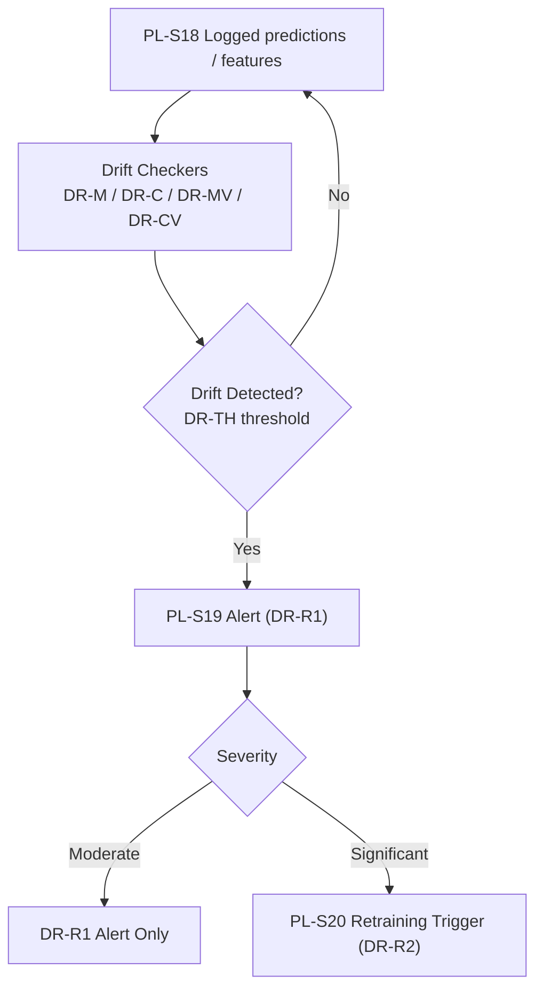

---

## Domain: PL-T10 Retraining / Continuous Learning Pipeline

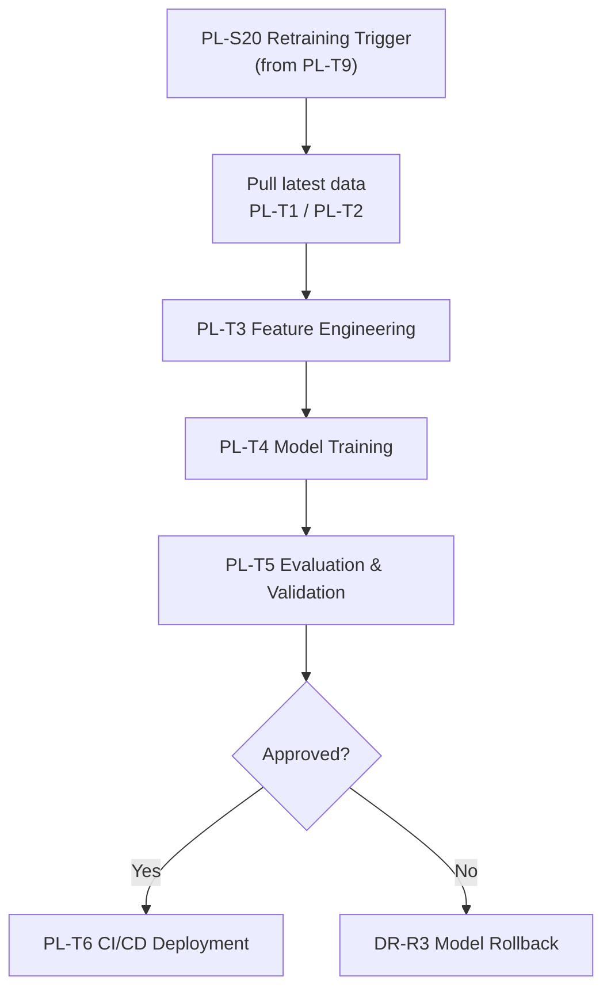

---

## Domain: PL-T11 Data Labeling / Annotation Pipeline

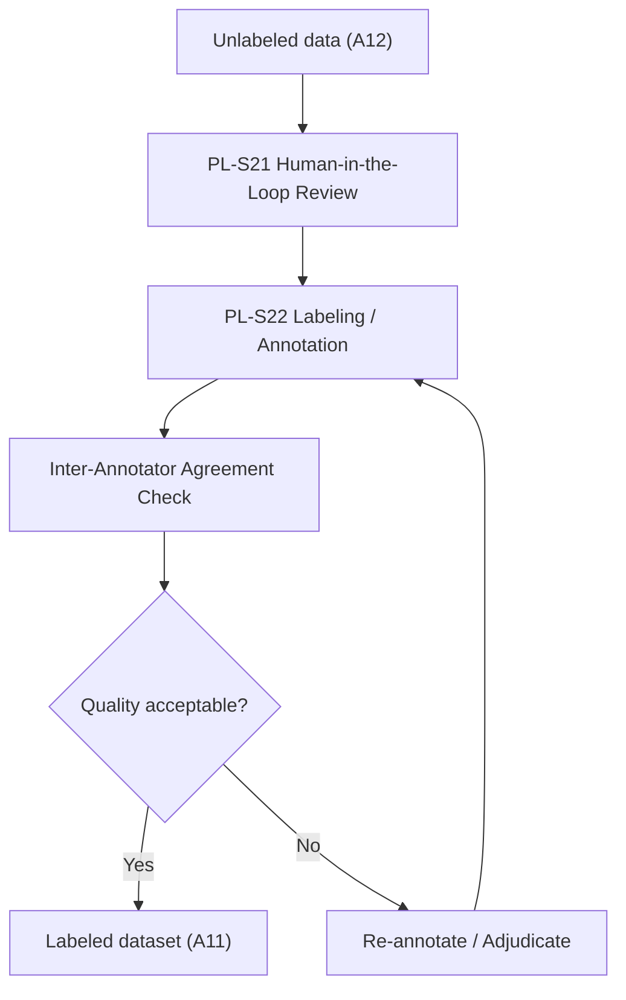

---

## Domain: PL-T12 RAG (Retrieval-Augmented Generation) Pipeline

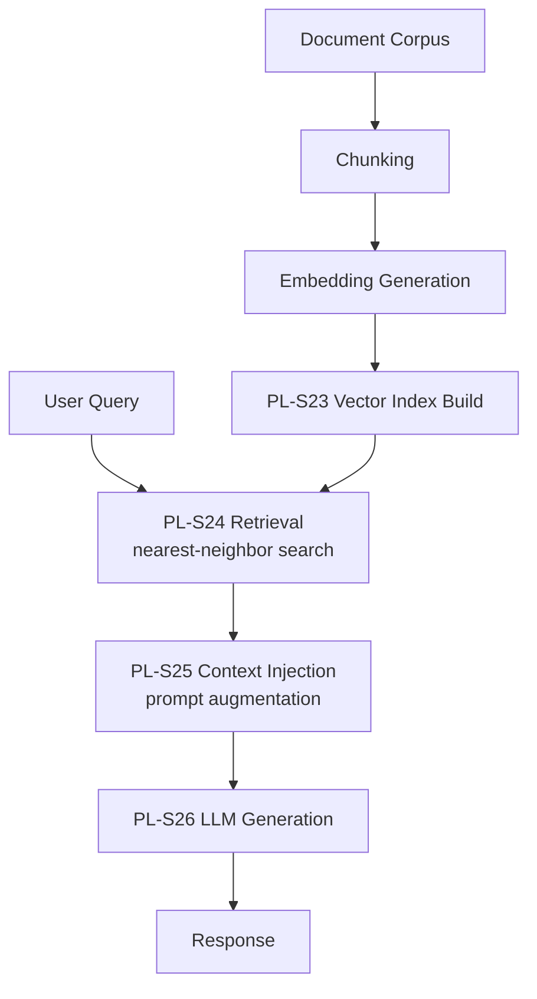

---

## Domain: PL-T13 LLM Fine-Tuning Pipeline

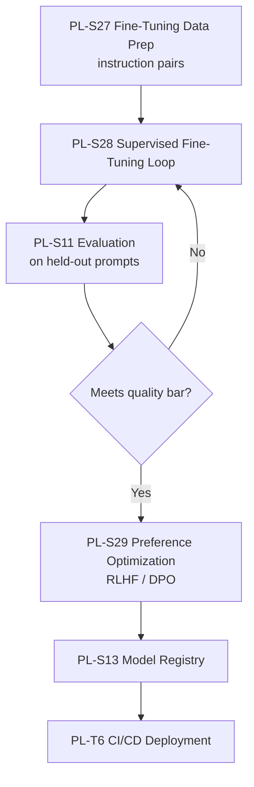

---

## Domain: PL-T14 A/B Testing / Experimentation Pipeline

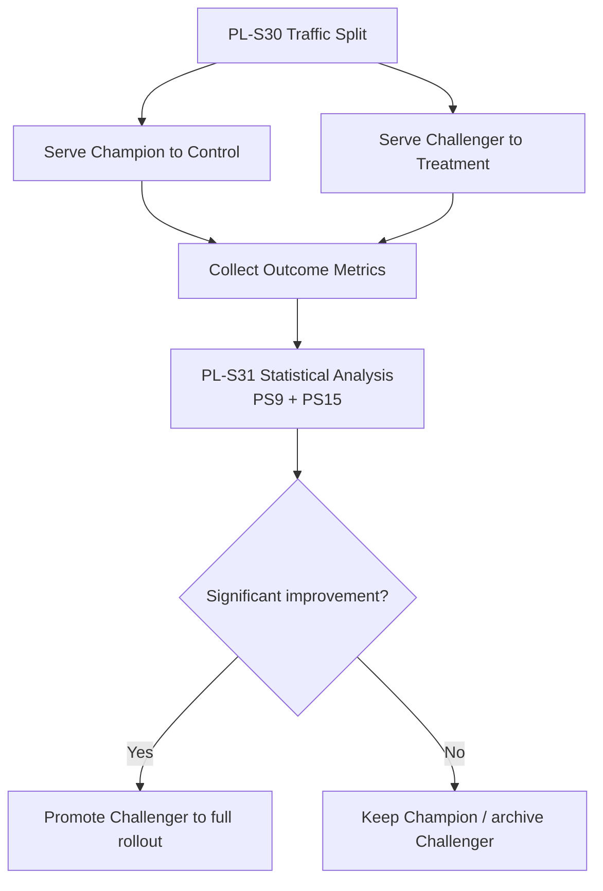

---

## Domain: Full Combined Signature : Per Pipeline Type [PL-F]

|Code|Pipeline Type|Primary Stage Codes|Inherits From|
|---|---|---|---|
|PL-F1|PL-T1 Batch ETL|PL-S3+PL-S4+PL-S2+PL-S5|A2x/A3x/A6x|
|PL-F2|PL-T2 Streaming ELT|PL-S3+PL-S5+PL-S4+PL-S2|A22 (sequential), A6x|
|PL-F3|PL-T3 Feature Engineering & Store|PL-S6+PL-S7|A3x/A4x, [DR-D] routing, [DR-W] windowing|
|PL-F4|PL-T4 Model Training|PL-S8+PL-S9+PL-S10+PL-S11+PL-S12+PL-S13|Any Model Code [LM…TSM] or Stacking [ST-V]|
|PL-F5|PL-T5 Evaluation & Validation|PL-S11+PL-S17|[DR-R5], PS-family metrics|
|PL-F6|PL-T6 CI/CD Deployment|PL-S13+PL-S14+PL-S15/S16+PL-S17|[DR-R5]|
|PL-F7|PL-T7 Batch Inference|PL-S15+PL-S7+PL-S18|[DR-W4]|
|PL-F8|PL-T8 Real-Time Inference|PL-S7+PL-S16+PL-S18|[DR-W2]/[DR-W3]|
|PL-F9|PL-T9 Monitoring & Drift|PL-S18+PL-S19+PL-S20|Full Drift Taxonomy: [DR-M]/[DR-C]/[DR-MV]/[DR-CV]/[DR-TH]/[DR-R]|
|PL-F10|PL-T10 Retraining|PL-S20 + full PL-T1→PL-T6 chain|[DR-R2]/[DR-R3]|
|PL-F11|PL-T11 Labeling|PL-S21+PL-S22|A12→A11 transition|
|PL-F12|PL-T12 RAG|PL-S23+PL-S24+PL-S25+PL-S26|LA8/LA9, NLP3 [GPT]-style generation|
|PL-F13|PL-T13 LLM Fine-Tuning|PL-S27+PL-S28+PL-S11+PL-S29|CA3/CA4/CA9, RL1-RL4, GM1/GM2|
|PL-F14|PL-T14 A/B Testing|PL-S30+PL-S31|PS9+PS15|

---

## Domain: Pipeline vs. Related Concepts : Disambiguation [PL-X]

|Code|Concept|How It Differs|Metaphor|
|---|---|---|---|
|PL-X1|ETL vs. ELT|ETL transforms _before_ loading (schema-on-write); ELT loads raw data first and transforms _after_, inside the warehouse (schema-on-read)|Cooking the meal before plating it, vs. plating raw ingredients and letting each diner cook their own portion at the table|
|PL-X2|Pipeline vs. Orchestration|A pipeline is the ordered chain of stages itself; orchestration (Airflow, Dagster, Prefect) is the scheduler that runs, retries, and sequences those stages|The recipe vs. the kitchen manager who decides when each station starts cooking|
|PL-X3|Batch vs. Streaming|Batch processes a bounded chunk of data on a schedule; streaming processes an unbounded, continuous flow of events as they arrive|A scheduled mail truck vs. a live phone line that's always open|
|PL-X4|Training Pipeline vs. Inference Pipeline|Training pipelines consume historical data to produce a model artifact; inference pipelines consume a trained artifact to produce predictions on new data|Building the calculator vs. using the calculator|
|PL-X5|MLOps Pipeline vs. plain DevOps CI/CD|MLOps pipelines version and gate _data and model artifacts_ alongside code, and need drift monitoring after deployment; plain CI/CD only ships code, which doesn't silently degrade the way a model does|Shipping software that behaves the same forever once deployed, vs. shipping a model that can quietly start drifting the moment the world changes|
|PL-X6|Feature Store vs. Data Warehouse|A feature store is optimized for low-latency, versioned, point-in-time-correct feature lookups for both training and serving; a data warehouse is optimized for broad analytical querying, not real-time serving|A pantry stocked and organized for a specific recipe, vs. a general grocery store you'd have to shop from every time|