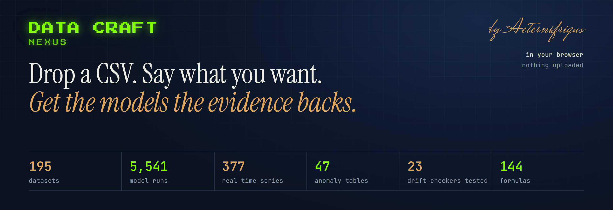
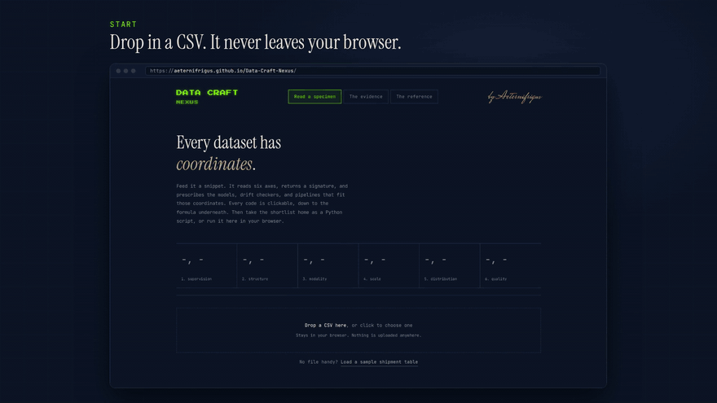

<p align="center">
  <a href="https://aeternifrigus.github.io/Data-Craft-Nexus/">
    
  </a>
</p>

<p align="center">
  <a href="https://aeternifrigus.github.io/Data-Craft-Nexus/"><b>Try it live</b></a>
  &nbsp;·&nbsp;
  <a href="https://aeternifrigus.github.io/Data-Craft-Nexus/dcn-tour.mp4"><b>Watch the tour</b></a>
  &nbsp;·&nbsp;
  <a href="docs/README.md"><b>Read the docs</b></a>
</p>

<p align="center">
  <a href="https://github.com/Aeternifrigus/Data-Craft-Nexus/actions/workflows/ci.yml"></a>
  <a href="https://aeternifrigus.github.io/Data-Craft-Nexus/"></a>
  
  <a href="#license"></a>
</p>

Most tabular ML advice fits in one line: **tune gradient boosting.** A 195-dataset benchmark agrees, so that is what Data Craft Nexus shows first. The rest of the page covers what that one line leaves out:

- **Is my file the kind of table the advice is for?** It checks for what makes every score lie and rules out what cannot work, with the reason.
- **Does the advice hold on my data?** You get a shortlist with each model's benchmark record, and a script that runs it on your whole file.
- **How will I know when it stops working?** Drift checkers are picked by how your data arrives and ranked by what they caught in a benchmark.

<p align="center">
  <a href="https://aeternifrigus.github.io/Data-Craft-Nexus/dcn-tour.mp4">
    
  </a>
  <br>
  <sub>18 seconds of it. Click for the full 95-second tour.</sub>
</p>

## How it works

| | step | what happens |
|:-:|---|---|
| **1** | **Drop a CSV** | It measures modality, scale, quality and drift. The file never leaves your browser. |
| **2** | **Say what you want** | It asks only what a file cannot say: the target, the kind of answer, whether row order matters, what a wrong answer costs. |
| **3** | **Trust the score first** | It flags what would make any score lie: a column that gives the answer away, an ID a model can memorise, copied rows, dates split at random. |
| **4** | **Get the shortlist** | Models and drift checkers ranked by what they were worth on real data, each with its record and its formula. What cannot work is listed with the reason. |
| **5** | **Take it home** | A Python script runs the shortlist on your whole file with the benchmark's cross-validation, next to a baseline that does nothing. Or run it right in the page. |

## Measured, not guessed

Every order on the page comes from a benchmark, and a rule written down before each run decided what the page does with the result.

| advice for | measured on | how the order is set |
|---|---|---|
| a number or a category | 195 PMLB datasets, 5,541 model runs | tuned boosting first, then an order learned leave-one-dataset-out |
| a future value | 377 real series from 21 collections, in two runs | the script's own forecasters, each value predicted from the ones before it |
| unusual records | 47 ADBench tables with known anomalies | detectors fitted without labels, scored against the labels |
| drift | 23 checkers on 630 test cases | what each one caught, minus its false alarms |

The site began by ranking models by how well they match a dataset's signature. The benchmark showed that this lost, so the page changed:

| how the first model is chosen | accuracy lost to the best model |
|---|---|
| matching models to the data's signature (the first design) | 4.79 points |
| a ranking learned from the benchmark | 1.60 |
| always gradient boosting | 1.45 |
| **gradient boosting, tuned over 10 settings** | **1.12** |

<sub>Balanced accuracy, median over 78 independent classification datasets, leave-one-dataset-out, related datasets counted once.</sub>

When a result is not more than luck, the page keeps the simpler order and says so, with the numbers. Where the mathematics can say why a model wins, the formula sits beside the measurement. And a test recomputes every published number from the committed results, so the page cannot drift from its data. The full record is in **[the evidence](docs/evidence.md)**.

## Run it

Open the [live page](https://aeternifrigus.github.io/Data-Craft-Nexus/), or download [`dist/index.html`](dist/index.html): one self-contained file that works straight from disk.

```bash
git clone https://github.com/Aeternifrigus/Data-Craft-Nexus.git
cd Data-Craft-Nexus
npm install && npm run serve    # http://localhost:8000
npm test                        # Node 20+
```

## Docs

| page | what is in it |
|---|---|
| [How it works](docs/how-it-works.md) | what is measured and asked, how models are ruled out and ranked, the take-home script |
| [The evidence](docs/evidence.md) | every benchmark, every number, the mathematics, and what is not done yet |
| [Development](docs/development.md) | tests, project layout, stack, deployment |
| [The benchmark](bench/README.md) | how each run was set up, written down before it ran |

## License

MIT: use it, remix it, cite it. Made by [Aeternifrigus](https://aeternifrigus.netlify.app/).
